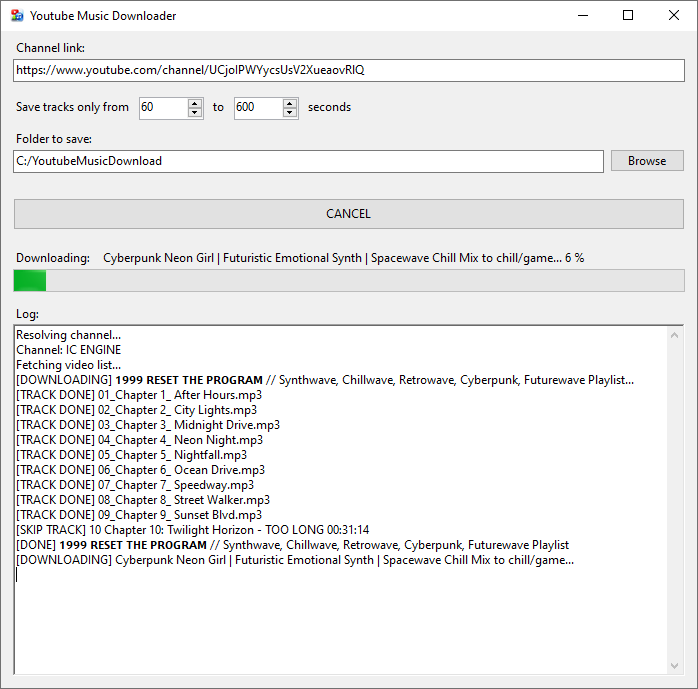

# YoutubeMusicDownloader

The application downloads all videos from a specified YouTube channel as MP3 files. It then splits the long file into individual tracks using YouTube timecodes. It is possible to filter out tracks that are too short or too long. Downloaded files are numbered and organized into separate folders.

It uses the YouTube-explode library and FFMPEG.

For personal, educational use only! All rights to the content belong to the copyright holders.

License: MIT